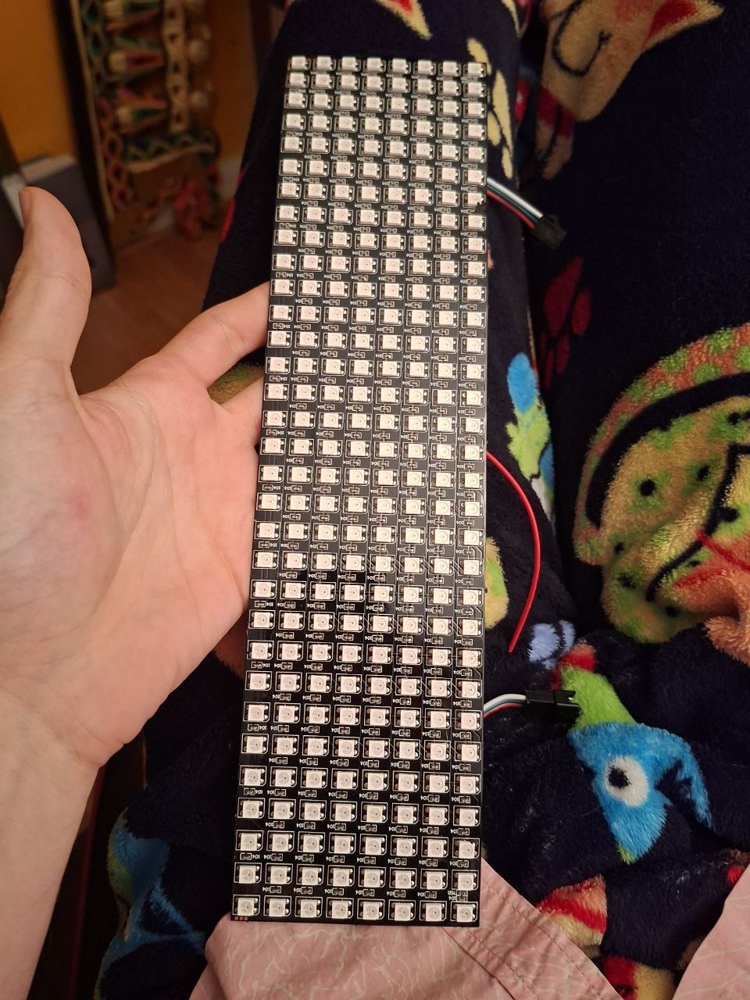
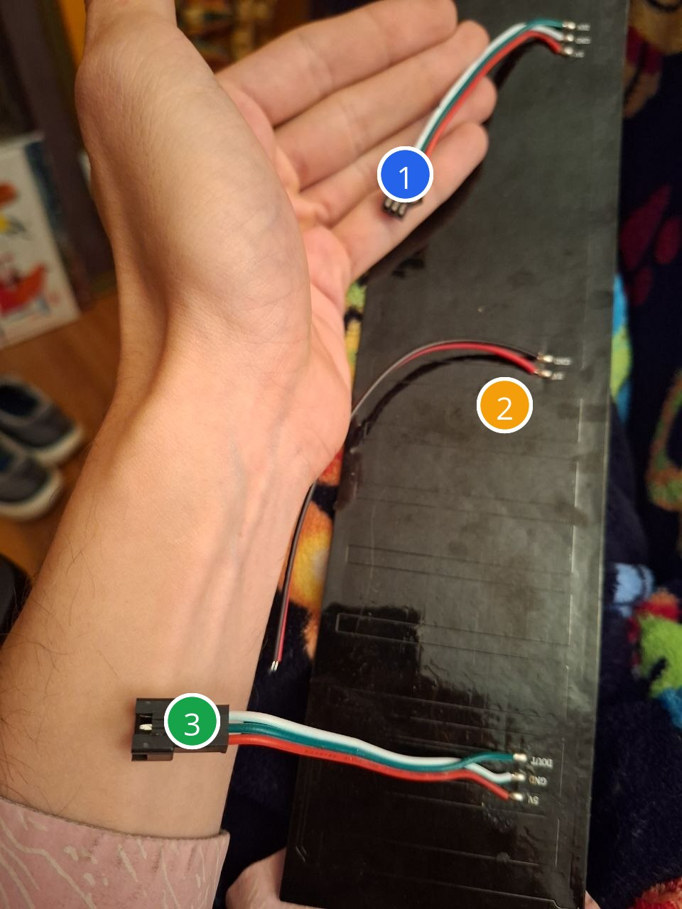

# ledmatrix

ESP32-powered car message board project for a flexible RGB LED matrix.

This repo is the starting point for a rear-window style display you can mount in a car and control from an ESP32. The goal is simple: show short messages, icons, and animations that are readable, lightweight, and easy to update.

## Reference photos

These are the panel photos you provided and are saved in this repo for hardware reference.

### Front of panel



### Back / wiring side



Connector guide:

- **1 - 3-pin data input side:** use this side only if the panel label says `DIN`. ESP32 `GPIO 5` goes to `DIN`, and ESP32 `GND` must connect to matrix `GND`.
- **2 - 2-wire power pair:** use this for the matrix's main 5V power input. Red is usually `5V`; black is usually `GND`.
- **3 - 3-pin output side:** this side is labeled `DOUT / GND / 5V` in the photo. It is for chaining another matrix, not for the ESP32 data input.

## What this appears to be

Based on the photos, this looks like a **flexible 5V addressable RGB LED matrix**, likely in the **WS2812 / NeoPixel family**, with:

- a 3-wire connector for **5V / GND / data**
- an additional power injection pair on the other side
- a long, narrow layout that is probably ideal for a car rear window message display

### Likely pin labels seen in the photo

The silkscreen on the back appears to show:

- **DIN** = data in
- **GND** = ground
- **5V** = power

Before powering it up, verify the exact pinout with a meter and a low-risk test.

## Project goal

Build an ESP32 app that can:

- display custom text messages
- scroll messages smoothly across the panel
- save favorite presets
- switch brightness for day/night driving
- optionally host a local Wi-Fi control page
- optionally support simple icons, emoji-like symbols, or animations

## Suggested first hardware setup

- **ESP32 dev board**
- **5V power supply** sized for the matrix current draw
- **level shifting** from ESP32 3.3V data to 5V data if needed
- inline fuse / safe automotive power path
- optional buck converter if sourcing from the car electrical system

## Important safety / legal note

Because this is for use in a car, keep it sane:

- do **not** display distracting or aggressive messages while driving
- check local laws about illuminated signs visible from outside a vehicle
- keep brightness low enough for night use
- design for stationary configuration and hands-free operation only

In other words: cool project, but let’s not build road-rage firmware.

## Proposed software direction

A clean first version could look like this:

1. **Core display driver**
   - map the matrix width/height
   - handle serpentine or progressive LED ordering
   - clear, draw pixel, draw glyph, scroll text

2. **Message engine**
   - static text
   - scrolling text
   - saved presets
   - speed / brightness control

3. **Control layer**
   - hardcoded test messages first
   - then BLE or Wi-Fi AP web UI
   - optional captive portal for phone control

4. **Automotive polish**
   - boot animation
   - low-power idle mode
   - startup brightness limit
   - preset lock mode for safe use

## Recommended repo layout

```text
ledmatrix/
├── README.md
├── index.html
├── docs/
│   └── reference/
│       ├── front-panel.jpg
│       └── back-wiring.jpg
├── src/
└── web/
    ├── app.js
    └── styles.css
```

## Next build target

A solid v1 would be:

- ESP32 drives the panel
- one built-in scrolling message demo
- brightness control
- simple phone-based config page
- message presets like:
  - THANK YOU
  - SORRY
  - LET ME MERGE
  - BRAKE LIGHT TEST
  - CUSTOM

## Notes for the first implementation

Things we need to confirm before coding the driver:

- exact matrix dimensions
- exact LED chipset
- wiring order / first pixel location
- whether rows are serpentine
- max safe brightness/current in-car

## Status

Repo initialized. Reference photos added. README drafted.

Firmware scaffold added:

- PlatformIO ESP32 project with firmware source in `src/`
- FastLED-based 8x32 physical / 32x8 logical WS2812B driver defaults
- startup corner/orientation test
- built-in `THANK YOU` scrolling text demo
- BLE control for message, brightness, and scroll speed
- clickable Web Bluetooth effect buttons for scroll, flash, rainbow, scanner, sparkle, and comet modes
- text and background color controls
- flash text mode pages through one word or 5-character word chunk at a time
- GitHub Pages-ready Web Bluetooth controller at root `index.html`

## GitHub Pages

The web UI is set up for GitHub Pages with the workflow in [.github/workflows/pages.yml](.github/workflows/pages.yml). It publishes the root `index.html` plus the `web/` and `docs/` asset folders, so the page can be hosted directly from the repository.

After pushing this branch to GitHub, set Pages to use GitHub Actions in the repository settings if it is not already enabled.

Next step: flash the ESP32 and verify the first-pixel/orientation settings.


# Firmware

ESP32 firmware for the LED matrix lives here. The first milestone is a
PlatformIO/Arduino sketch that drives a likely 8x32 WS2812B-style flexible
matrix as a 32x8 landscape sign with FastLED.

## Build and upload

Install PlatformIO, connect the ESP32, then run:

```bash
pio run -t upload
pio device monitor
```

## Current behavior

- starts at very low brightness
- limits FastLED power draw to 300 mA for safer USB bench testing
- shows a startup corner/orientation test
- scrolls the built-in message `THANK YOU`
- advertises as a BLE device named `LED-Matrix`
- accepts BLE UART-style text commands for message, brightness, and speed

## Bluetooth control

Use a BLE app such as nRF Connect and connect to `LED-Matrix`.

Nordic UART-style UUIDs:

- service: `6E400001-B5A3-F393-E0A9-E50E24DCCA9E`
- write/RX: `6E400002-B5A3-F393-E0A9-E50E24DCCA9E`
- notify/TX: `6E400003-B5A3-F393-E0A9-E50E24DCCA9E`

Write one of these text commands to the RX characteristic:

```text
MSG=THANK YOU
MODE=TEXT
TMOVE=SCROLL
TMOVE=FLASH
TMOVE=CENTER
TMOVE=BOUNCE
TCLR=STATIC
TCLR=RAINBOW_STATIC
TCLR=RAINBOW_CYCLE
MODE=RAINBOW
MODE=SCANNER
MODE=SPARKLE
MODE=COMET
MODE=BLANK

# Legacy single-field compatibility:
FX=RAINBOW
FX=SCANNER
FX=SPARKLE
FX=COMET
FX=SCROLL
FX=FLASH
FX=CENTER
FX=BOUNCE
FX=RAINBOW_TEXT
FX=RAINBOW_LOOP
FX=RAINBOW_GLOW
FX=BLANK
FG=#FF4614
BG=#000000
BRI=8
SPEED=45
STATUS
HELP
```

Plain text without a key also updates the message.

## Configuration

Edit these constants in `src/main.cpp` after the first hardware test:

- `kDataPin`: ESP32 GPIO wired to the panel `DIN`
- `kPanelColumns` / `kPanelRows`: physical panel size
- `kDisplayRotation`: rotation from physical panel to landscape display
- `kPanelSerpentineRows`, `kPanelReverseColumns`, `kPanelReverseRows`: pixel ordering/orientation
- `kDefaultBrightness`: startup brightness
- `kMilliampLimit`: FastLED current limiter
- `kDefaultMessage`: startup text
- `kBleDeviceName`: Bluetooth device name

The reference panel appears to be a common flexible 8x32 5V RGB matrix, but
verify the pinout, first-pixel location, and row order before increasing
brightness.
